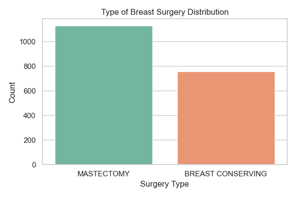
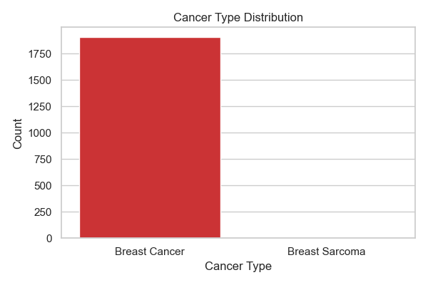
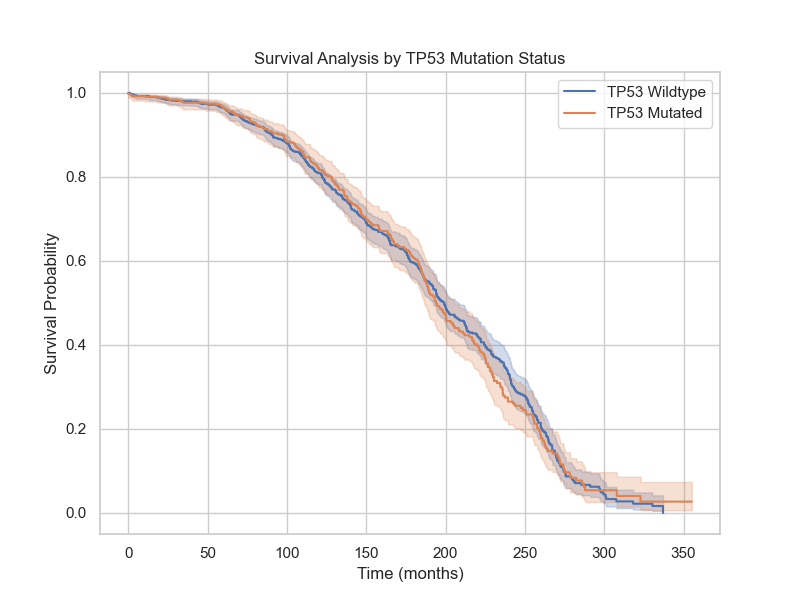
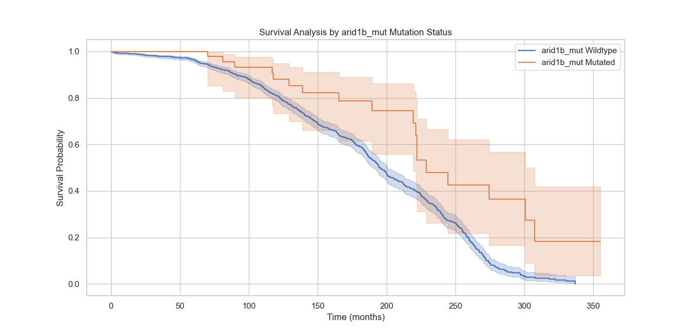
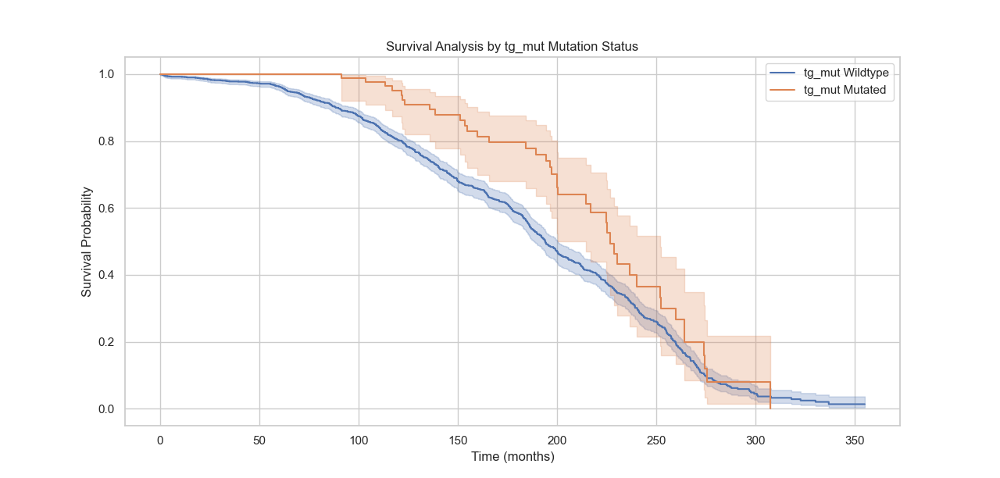

# 🔬 Survival Analysis of Breast Cancer Patients Based on Gene Mutation Status (METABRIC Dataset)

This project conducts a **survival analysis** using the **METABRIC RNA + Mutation dataset**, focusing on how mutations in key genes affect patient outcomes. It includes **descriptive statistics**, **data visualization**, **mutation profiling**, and **Kaplan-Meier survival analysis** with **log-rank testing**.


## 🧾 Dataset

* **Name**: `METABRIC_RNA_Mutation.csv`  
* **Source**: [METABRIC breast cancer dataset](https://www.kaggle.com/datasets/raghadalharbi/breast-cancer-gene-expression-profiles-metabric)  
* **Content**:  
  -  31 clinical metadata features  
  -  mRNA z-score expression levels for 331 genes  
  -  Gene mutation status for 175 genes  
  -  Survival outcome data for over 1,900 breast cancer patients  


---
```
METABRIC_Project/
│
├── data/                           # Dataset files
│   └── METABRIC_RNA_Mutation.csv   # Main dataset
│
├── scripts/                        # Python scripts for analysis
│   └── analysis.py                 # Main analysis script
│
├── results/                        # Analysis outputs and visualizations
│   └── plots/                      # Plots generated during analysis
│       ├── age_distribution.png
│       ├── type_of_breast_surgery_distribution.png
│       ├── cancer_type_distribution.png
│       ├── survival_analysis_by_TP53_mutation_status.png
│       ├── survival_analysis_by_arid1b_mutation_status.png
│       ├── survival_analysis_by_map3k1_mutation_status.png
│       └── survival_analysis_by_tg_mutation_status.png
│
└── README.md                       # Project documentation
```
---


## ⚙️ Workflow Summary

### 1️⃣ Data Loading and Inspection

* Load and inspect dataset structure
* Detect and report missing values
* Explore unique values for each categorical column

### 2️⃣ Descriptive Statistics

* Numerical summary using `.describe()`
* Categorical summary using `.describe(include='object')`

---


## 📊 Visualizations
To understand the clinical landscape, we visualized important patient features:

- **Age at Diagnosis Distribution**: A histogram showing the distribution of age among patients.
  
```python
sns.histplot(df['age_at_diagnosis'], bins=30, kde=True)
```
  

- **Type of Breast Surgery**: A countplot showing frequencies of surgery types.

```python
sns.countplot(x='type_of_breast_surgery', data=df)
```
  

- **Cancer Type Distribution**: A countplot for the distribution of different cancer types.

```python
sns.countplot(x='cancer_type', data=df)
```
  


---

## 🧬 Mutation-Based Survival Analysis

### 🔎 Mutation Processing

* Mutation columns ending in `_mut` are extracted.
* For each gene:

  * A binary column is created (`mutated` vs `wildtype`).
  * Patients are grouped accordingly.

### 📉 Survival Modeling

* **Kaplan-Meier Estimator** is used to model survival curves for each gene.
* **Log-rank tests** are performed to compare survival distributions.
* Genes with significant differences are identified.

### ✅ Top Genes Output

Top 10 genes with the lowest **p-values** are reported as potentially significant in influencing survival.

### 📈 Kaplan-Meier Plots

The survival curves for the top 3 genes are plotted to visually demonstrate the impact of mutations.

```python
kmf.fit(group[duration_col], group[event_col], label=label_name)
kmf.plot_survival_function()
```

---

## 🔍 Notable Mutations: Example Interpretation

> Based on output, interpretations might include:

* **TP53**: Frequently mutated; associated with aggressive tumors and **poorer prognosis**.
* **PIK3CA**: Involved in PI3K pathway; sometimes linked to **better prognosis** in certain subtypes.
* **GATA3**: Regulates differentiation; mutations may affect **luminal subtype** development.

---

## 📦 Dependencies

```bash
pip install pandas numpy matplotlib seaborn lifelines
```

---
## 📊 Survival Analysis of Gene Mutations

This section highlights survival differences between patients with and without specific gene mutations, using Kaplan-Meier survival curves.

### TP53 Mutation Status


### ARID1B Mutation Status


### MAP3K1 Mutation Status


### TG Mutation Status



---
## ▶️ How to Run

1. Save the dataset as `METABRIC_RNA_Mutation.csv` in your project directory.
2. Run the Python script:

```bash
python your_script_name.py
```

---

## 📜 License
This project is licensed under the MIT License - see the [LICENSE](LICENSE) file for details.

---


