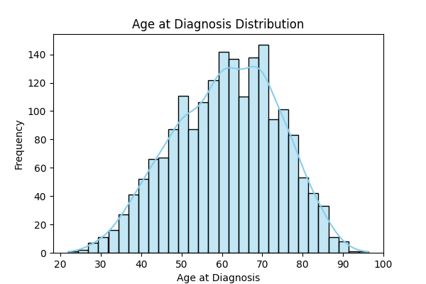
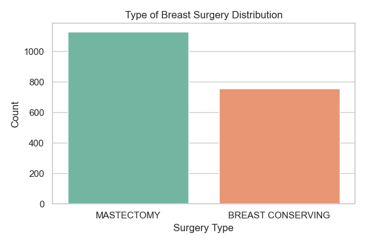
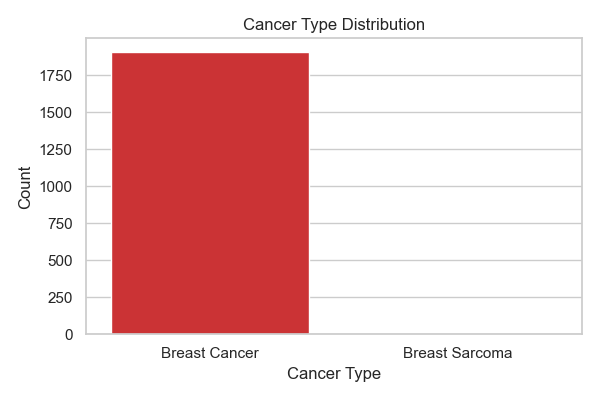
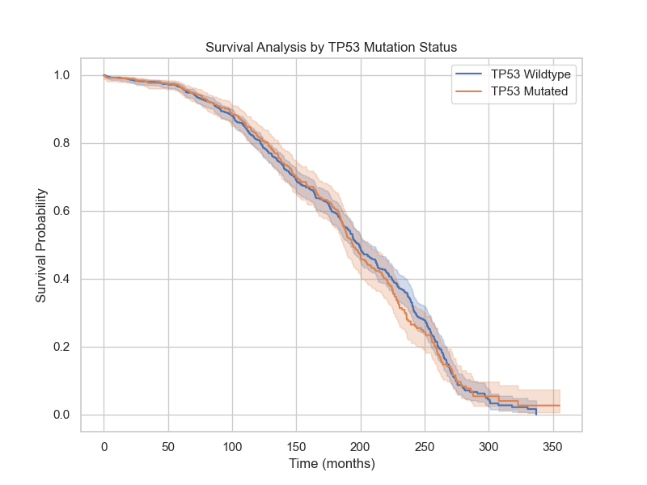
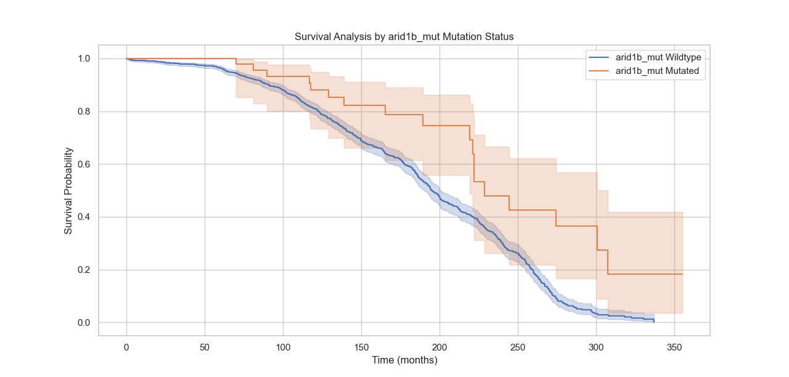
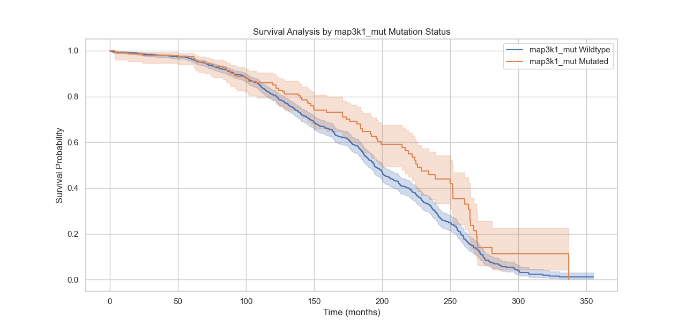
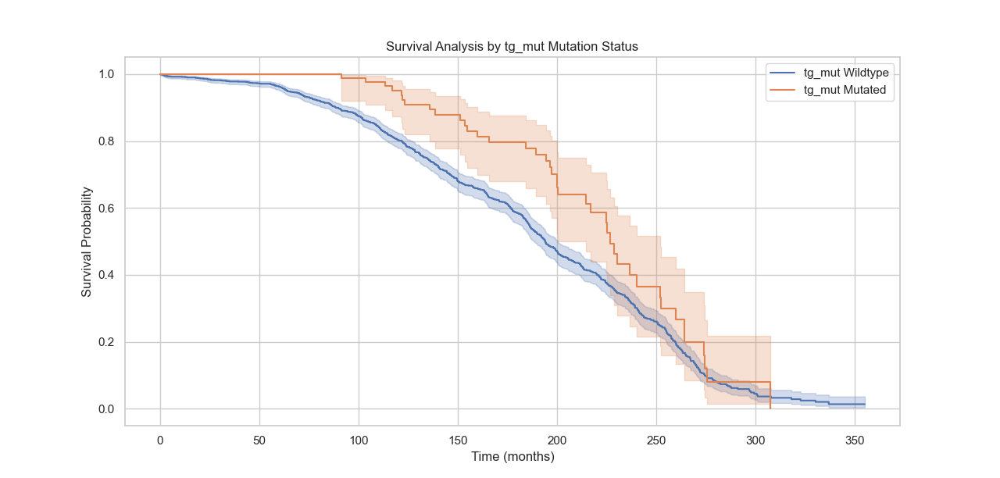
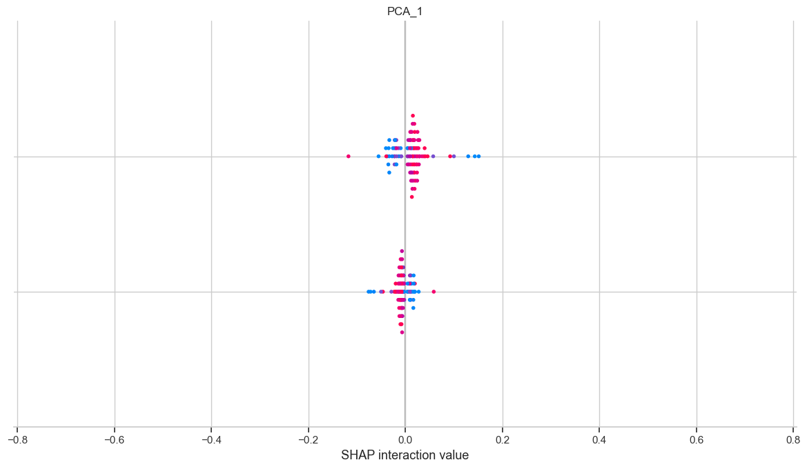
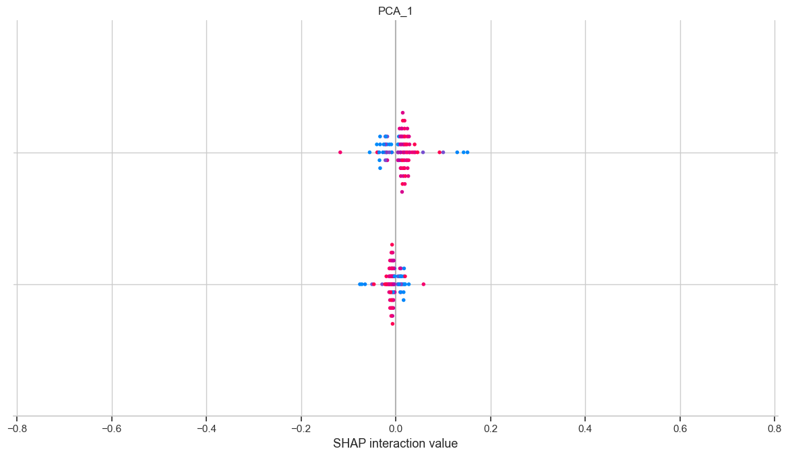

# 🔬 Survival Analysis and Machine Learning Prediction in Breast Cancer Patients (METABRIC Dataset)

This project analyzes survival outcomes in breast cancer patients using the **METABRIC RNA + Mutation dataset**, combining classical survival analysis and machine learning-based classification. The pipeline includes **descriptive statistics**, **data visualization**, **mutation profiling**, **Kaplan-Meier survival analysis**, **Cox Proportional Hazards modeling**, **feature engineering from gene expression**, and **binary classification (long vs short survival)** using **Random Forest** and **SHAP** for model interpretation.

---

## 🧾 Dataset

* **Name**: `METABRIC_RNA_Mutation.csv`  
* **Source**: [METABRIC breast cancer dataset](https://www.kaggle.com/datasets/raghadalharbi/breast-cancer-gene-expression-profiles-metabric)  
* **Content**:  
  -  31 clinical metadata features  
  -  mRNA z-score expression levels for 331 genes  
  -  Gene mutation status for 175 genes  
  -  Survival outcome data for over 1,900 breast cancer patients  


---
```
METABRIC_Project/
│
├── data/                           # Dataset files
│   └── METABRIC_RNA_Mutation.csv   # Main dataset
│
├── scripts/                        # Python scripts for analysis
│   └── analysis.py                 # Main analysis script
│
├── results/                        # Analysis outputs and visualizations
│   └── plots/                      # Plots generated during analysis
│       ├── age_distribution.png
│       ├── type_of_breast_surgery_distribution.png
│       ├── cancer_type_distribution.png
│       ├── survival_analysis_by_TP53_mutation_status.png
│       ├── survival_analysis_by_arid1b_mutation_status.png
│       ├── survival_analysis_by_map3k1_mutation_status.png
│       └── survival_analysis_by_tg_mutation_status.png
│       ├── shap_summary_bar.png
│       ├── shap_beeswarm.png
│       └── roc_curve.png
│
└── README.md                       # Project documentation
```
---


## ⚙️ Workflow Summary

### 1️⃣  Data Exploration & Visualization

* Load and inspect dataset structure
* Detect and report missing values
* Explore unique values for each categorical column
* Visualize:

  * Age at Diagnosis
  * Type of Breast Surgery
  * Cancer Type


### 2️⃣ Mutation-Based Survival Analysis

* Create binary flags for mutation columns (`_mut` suffix)
* Kaplan-Meier estimator with log-rank test for top genes
* Visualize survival difference for top 3 genes

### 3️⃣ Cox Proportional Hazards Model

* Fit multivariate Cox model on top mutated genes
* Interpret hazard ratios

---


## 📊 Visualizations
To understand the clinical landscape, we visualized important patient features:

- **Age at Diagnosis Distribution**: A histogram showing the distribution of age among patients.
  
```python
sns.histplot(df['age_at_diagnosis'], bins=30, kde=True)
```
  

- **Type of Breast Surgery**: A countplot showing frequencies of surgery types.

```python
sns.countplot(x='type_of_breast_surgery', data=df)
```
  

- **Cancer Type Distribution**: A countplot for the distribution of different cancer types.

```python
sns.countplot(x='cancer_type', data=df)
```
  


---

## 🧬 Mutation-Based Survival Analysis

### 🔎 Mutation Processing

* Mutation columns ending in `_mut` are extracted.
* For each gene:

  * A binary column is created (`mutated` vs `wildtype`).
  * Patients are grouped accordingly.

### 📉 Survival Modeling

* **Kaplan-Meier Estimator** is used to model survival curves for each gene.
* **Log-rank tests** are performed to compare survival distributions.
* Genes with significant differences are identified.

### ✅ Top Genes Output

Top 10 genes with the lowest **p-values** are reported as potentially significant in influencing survival.

### 📈 Kaplan-Meier Plots

The survival curves for the top 3 genes are plotted to visually demonstrate the impact of mutations.

```python
kmf.fit(group[duration_col], group[event_col], label=label_name)
kmf.plot_survival_function()
```

---

## 🔍 Notable Mutations: Example Interpretation

> Based on output, interpretations might include:

* **TP53**: Frequently mutated; associated with aggressive tumors and **poorer prognosis**.
* **PIK3CA**: Involved in PI3K pathway; sometimes linked to **better prognosis** in certain subtypes.
* **GATA3**: Regulates differentiation; mutations may affect **luminal subtype** development.

---

## 📦 Dependencies

```bash
pip install pandas numpy matplotlib seaborn lifelines
```

---
## 📊 Survival Analysis of Gene Mutations

This section highlights survival differences between patients with and without specific gene mutations, using Kaplan-Meier survival curves.

### TP53 Mutation Status


### ARID1B Mutation Status


### MAP3K1 Mutation Status


### TG Mutation Status



---
## Cox Proportional Hazards Model

To deepen the survival analysis beyond Kaplan-Meier estimation, we used a Cox Proportional Hazards Model on four key mutations (`TP53`, `MAP3K1`, `TG`, `ARID1B`). This approach models the hazard of death over time while controlling for other variables.

### 📈 Key Findings:

| Gene        | Hazard Ratio (HR) | Interpretation                                              | p-value |
|-------------|-------------------|--------------------------------------------------------------|---------|
| `TP53`      | 0.98              | Not statistically significant (HR ~1, p = 0.82)             | 0.82    |
| `MAP3K1`    | 0.72              | ~28% reduced risk of death when mutated (p = 0.01)          | 0.01    |
| `TG`        | 0.69              | ~31% reduced risk of death when mutated (p = 0.02)          | 0.02    |
| `ARID1B`    | 0.45              | ~55% reduced risk of death when mutated (p < 0.005)         | <0.005  |

> **Note**: Hazard Ratios (HR) below 1 indicate a protective effect; HR > 1 indicates increased risk. `ARID1B`, `MAP3K1`, and `TG` mutations appear to be associated with significantly **longer survival times** in this dataset.

### 📊 Model Details:

- **Concordance Index**: 0.54  
- **Partial AIC**: 9859.24  
- **Log-likelihood ratio test**: p < 0.005

We conclude that certain gene mutations (especially `ARID1B` and `MAP3K1`) may have potential prognostic value for breast cancer outcomes in the METABRIC cohort.

---

### 🧪 Feature Engineering from mRNA Expression Data

To enhance the dataset and enable more effective modeling and analysis, we engineered several features based on mRNA gene expression:

#### 1. **Gene Expression Average**

For each patient, we computed the **mean expression value across all genes**. This feature serves as a simple yet informative summary of the overall transcriptional activity within each tumor sample. It can help distinguish between samples with generally high or low expression levels.

```python
df['GeneExpression_Average'] = df_expression.mean(axis=1)
```

#### 2. **Principal Component Analysis (PCA)**

Given the high dimensionality of gene expression data, we applied **PCA** to reduce the number of features while preserving the most important variance in the data. We extracted the **top 5 principal components (PCA\_1 to PCA\_5)**, which can capture global expression patterns and relationships between samples in a compressed form.

```python
from sklearn.decomposition import PCA
pca = PCA(n_components=5)
pca_components = pca.fit_transform(df_expression.fillna(0))
```

These new features are especially useful for downstream tasks such as:

* Visualizing patient clusters
* Feeding into predictive models
* Exploring associations with clinical outcomes (e.g., survival)

#### ➕ Resulting Features:

* `GeneExpression_Average`
* `PCA_1`, `PCA_2`, `PCA_3`, `PCA_4`, `PCA_5`
  
Below is a preview of the engineered features, including the average gene expression per patient and the top 5 principal components derived from PCA:
  
| patient_id | GeneExpression_Average | PCA_1     | PCA_2     | PCA_3     | PCA_4     | PCA_5     |
|------------|------------------------|-----------|-----------|-----------|-----------|-----------|
| 0          | 0.5145                 | -3921.93  | 28.14     | -3.05     | 7.00      | -4.63     |
| 2          | 0.2014                 | -3920.09  | -27.08    | -17.38    | -3.86     | -2.11     |
| 5          | 0.4280                 | -3916.85  | 51.68     | -9.46     | 10.42     | -1.12     |
| 6          | 0.5349                 | -3915.85  | 52.48     | 0.84      | 7.83      | 1.87      |
| 8          | 0.1780                 | -3914.24  | -71.75    | 11.61     | -0.31     | 2.30      |

---
## 🧪 Feature Engineering from mRNA Expression

### ➕ Added Features:

* `GeneExpression_Average` = mean expression per patient
* `PCA_1` to `PCA_5` = top 5 principal components from expression matrix

These features are saved to `METABRIC_features.csv` for downstream ML.

---
## 🤖 Machine Learning: Predicting Survival Group

### 📌 Task:

Predict whether a patient survived **≥ 60 months** using engineered features.

### 🔍 Features Used:

* `GeneExpression_Average`, `PCA_1`, `PCA_2`, `PCA_3`, `PCA_4`, `PCA_5`

### ✅ Model:

* `RandomForestClassifier` from scikit-learn

### 📈 Evaluation:

* **ROC AUC Score**: `0.999`
* **Confusion Matrix**:

  ```
  [[ 94   0]
   [  4 283]]
  ```
* **Classification Report**:

  * Precision: 0.96 (class 0), 1.00 (class 1)
  * Accuracy: 0.99

### 🧠 Model Interpretation (SHAP):

* Used `shap.TreeExplainer` to understand feature importance
* Visualized both bar and beeswarm plots

---
### SHAP Feature Importance (Random Forest)

We used SHAP values to interpret the Random Forest classifier trained on engineered gene expression features. The bar plot summarizes global feature importance, while the beeswarm plot visualizes individual-level impacts.

- **Bar Plot**
  

- **Beeswarm Plot**
  

## ▶️ How to Run

1. Save the dataset as `METABRIC_RNA_Mutation.csv` in your project directory.
2. Run the Python script:

```bash
pip install pandas numpy matplotlib seaborn lifelines scikit-learn shap
python analysis.py
```
---

## 📜 License
This project is licensed under the MIT License - see the [LICENSE](LICENSE) file for details.

---
